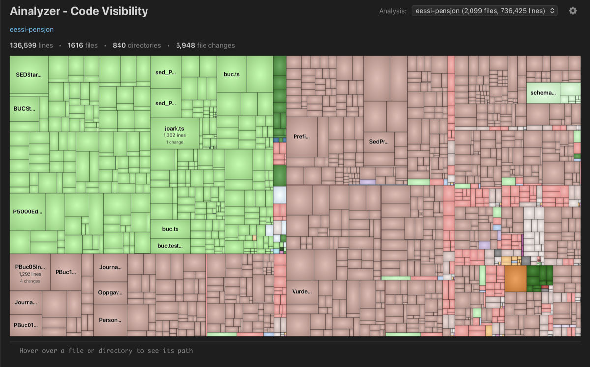

# Ainalyzer

Interactive treemap visualization for exploring code volume and change patterns across multiple repositories.



Point the tool at a local folder containing one or more Git repositories. Analysis runs entirely on your machine - no data is sent anywhere.

> **Note:** Only tested on macOS.

## Usage

### Prerequisites

Verify required tools are installed:

```bash
git --version
python3 --version
node --version
cloc --version
```

| Tool | Minimum | Install |
|------|---------|---------|
| Git | any     | - |
| Python | 3.9+    | - |
| Node.js | 18+     | - |
| cloc | any     | `brew install cloc` |

### Setup

Clone:

```bash
git clone https://github.com/kjetiljd/ainalyzer.git
cd ainalyzer
```

### Analyze repositories

First time: provide name and path:
```bash
./aina analyze <myproject> </path/to/repos>
```
> Replace `<myproject>` with any name you choose (e.g., `backend`, `mobile-apps`, `my-teams-repos`).
> Replace `</path/to/repos>` with the actual path to your repositories folder (either a repository or a folder with multiple repositories).

Re-analyze (uses stored path):
```bash
./aina analyze <myproject>
```
View results in browser:
```bash
./aina show
```


### Commands

```
./aina analyze <name> [path]   Analyze repos (path required first time)
./aina list                    List registered analysis sets
./aina remove <name>           Remove analysis set
./aina show [-p PORT]          Open in browser (default: port 8080)
```

### Docker (alternative)

No local installation required - just Docker.

```bash
# Build image
docker build -t ainalyzer .

# Analyze repos (mount your repos folder and persist data)
docker run --rm -v /path/to/repos:/repos -v ~/.aina:/root/.aina ainalyzer \
    ./aina analyze myproject /repos

# Serve results (mount repos for file viewer and clocignore support)
docker run --rm -p 8080:8080 -v /path/to/repos:/repos -v ~/.aina:/root/.aina ainalyzer
```

Open http://localhost:8080 to view.

---

## Tutorial

Once you've run `./aina show`, open the browser to explore your codebase.

### Navigation

- **Click** any rectangle to drill down into that folder/repo
- **Breadcrumb** at the top shows your current location - click any segment to jump back
- **Escape key** navigates up the breadcrumb (also closes modals)
- **Click twice** on a file to open the code viewer with syntax highlighting

### Analysis Modes

Open **Settings** (gear icon, top-right) to switch between three analysis modes:

| Mode | Shows | Colors indicate |
|------|-------|-----------------|
| **Code size** | Lines of code | Directory depth |
| **Change activity** | Lines of code | Commit frequency (purple=stable, yellow=hot) |
| **File types** | Lines of code | Programming language |

### Filtering and Exclusions

Focus on the code that matters by filtering out noise:

**Right-click** any file or folder to quickly exclude it. Or open Settings to manage exclusions:

- **Hide .clocignore files** - respects `.clocignore` patterns in your repos
- **Custom exclusions** - add glob patterns to hide generated files:
  - `**/node_modules/**` - dependencies
  - `**/*.min.js` - minified JavaScript
  - `**/generated/**` - generated code folders
  - `**/*.pb.go` - protobuf generated files
  - `**/dist/**` - build output

Exclusions apply instantly - no re-analysis needed. All settings are saved in your browser.

### Activity Timeframe

When using **Change activity** mode, toggle between time ranges:
- **3 months** - recent development focus
- **1 year** - longer-term patterns (default)

### Appearance Options

- **Enable 3D cushion effect** - WinDirStat-style shading for visual depth
- **Hide folder borders** - cleaner look when using cushion mode
- **Show repository borders** - highlights git repo boundaries with distinct colors

### Hover Information

The statusline at the bottom shows:
- Full path to the hovered item
- Line count
- File change count (based on selected timeframe)
- "(repo)" indicator for git repository roots

### Tips

- Large files (>10,000 lines) are truncated in the viewer
- Purple files in activity mode = no changes in the selected period
- Bright yellow = high activity hotspots
- Use exclusions to hide generated code and focus on source

---

For development, see [DEVELOPMENT.md](./DEVELOPMENT.md).
